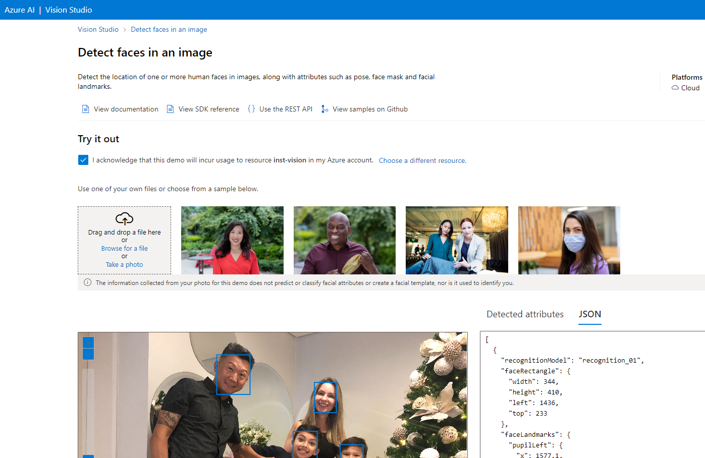
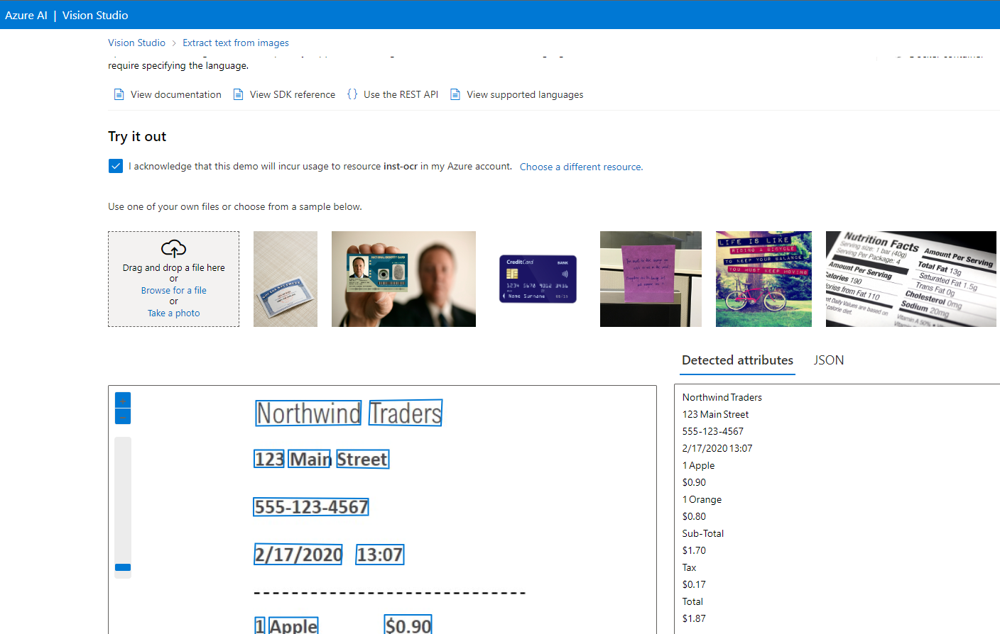
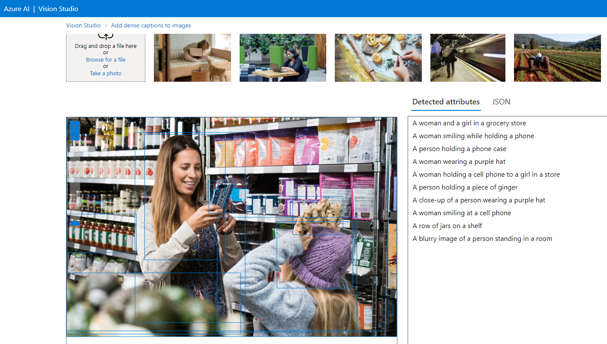

# Aula: Reconhecimento Facial e transformação de imagens em Dados no Azure ML

Passo a passo do projeto Reconhecimento Facial e transformação de imagens em Dados no Azure ML da DIO.

Links importantes:

[Detect faces in Vision Studio](https://microsoftlearning.github.io/mslearn-ai-fundamentals/Instructions/Labs/04-face.html)

[Read text in Vision Studio](https://microsoftlearning.github.io/mslearn-ai-fundamentals/Instructions/Labs/05-ocr.html)

[Analyze images in Vision Studio](https://microsoftlearning.github.io/mslearn-ai-fundamentals/Instructions/Labs/03-image-analysis.html)

## Passo 1: Criando a área de trabalho (workspace) para o Azure AI

Entrar no portal.zure.com e clicar em "Criar recurso", pesquisar por Azure ... no marketplace e selecionar para criar.

Preencher aqui os passos

